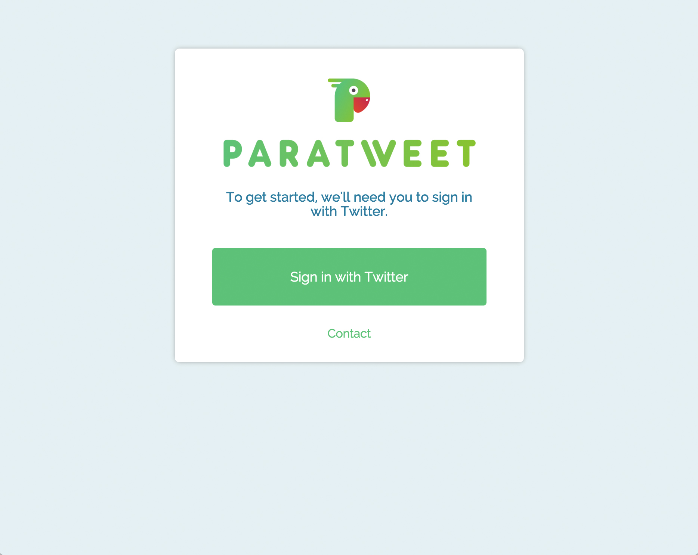
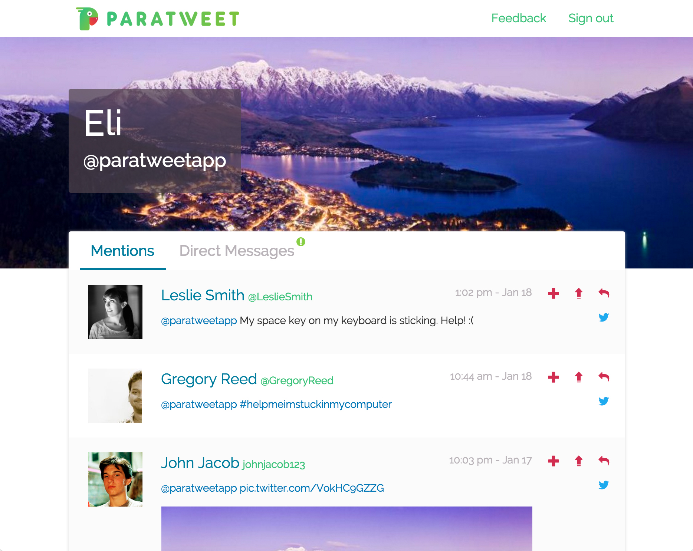
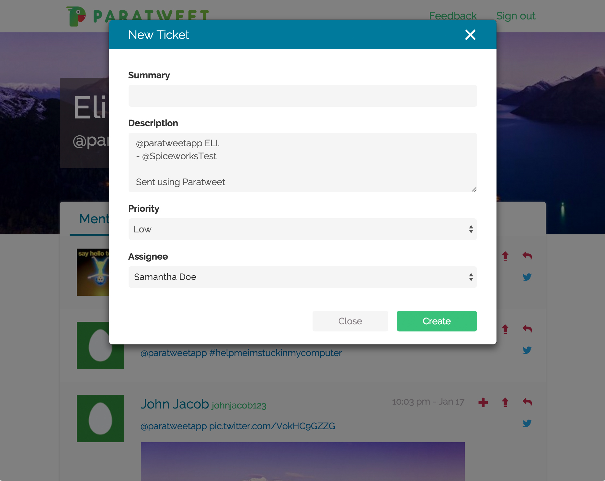
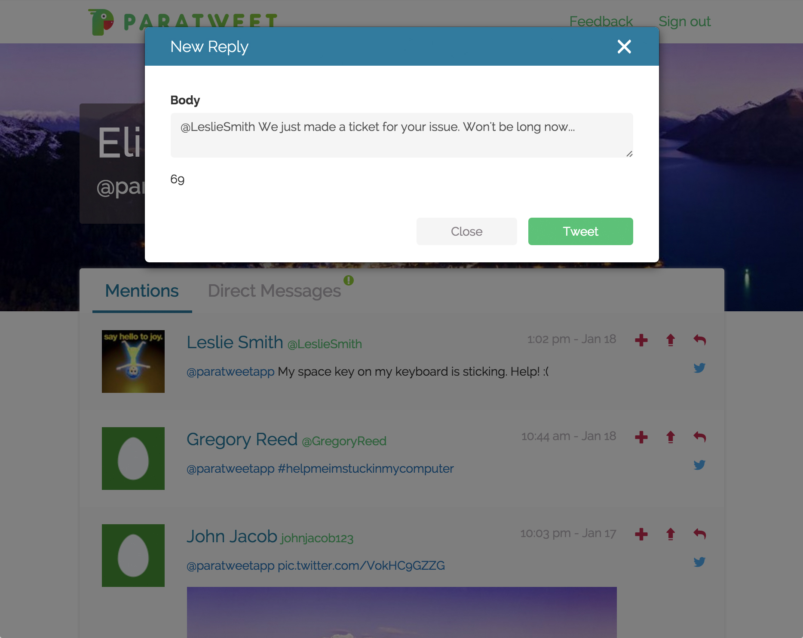

# Note: This app no longer works because the Spiceworks App Center has been removed.

# Paratweet

This is an application for turning tweets that you're mentioned in or are sent
via DM into Spiceworks Helpdesk tickets. Built using Meteor.js, Twitter's API,
Spiceworks API, and was hosted on Heroku.

### Screenshots - Designs by Becca Ciceri

###### Login Page:

###### Mentions:

###### Direct Messages:

###### New Ticket:

###### Reply:

